# Robert | Software Engineer & Founder, UpHill Solutions
 

Founder of [UpHill Solutions](https://uphillsolutions.tech), focused on custom web and automation solutions. 

Most of my code here is private, but I do contribute to open source when I can and sponsorship does help me prioritize that.

## About Me

- 🌍 **Location:** USA
- 💼 **Occupation:** Software Developer & Consultant
- 🔭 **Currently working on:** Client project (private repos), open-source contributions, and personal tooling
- 🧠 **Talk to Me About:** Web development, backend architecture, automation, or anything tech  
- 📫 **Reach me:** [Email](mailto:robert.hill@uphillsolutions.tech) | [LinkedIn](https://www.linkedin.com/in/robert-hill-a6a189125/) | [Website](https://uphillsolutions.tech)
- 🥾 **Fun Fact:** If I'm not online then I'm probably out hiking or exploring remote places
  
## Languages and Tools

  <!-- Core Languages -->
  
  
  
  
  
  

  <!-- Web & Frontend -->
  
  
  
  
  
  
  

  <!-- Development Tools -->
  
  
  
  
  

  <!-- Editors -->
  
  

  <!-- Operating Systems -->
  
  
  

## My GitHub Stats

## Consulting Services
The UpHill Solution to your uphill struggles.

I offer tailored web development and automation services for clients who need fast, maintainable, and scalable solutions. 

Feel free to contact us if you're launching a site, streamlining internal tools, integrating systems, or just need a free 30-min consult to see what we can do to help.

- [Contact Us](https://uphillsolutions.tech/contact-us/)

## Get in Touch

- **Email:** robert.hill@uphillsolutions.tech
- **Website:** [UpHill Solutions](https://uphillsolutions.tech)
- **LinkedIn:** [Robert Hill](https://www.linkedin.com/in/robert-hill-a6a189125/)

Looking forward to connecting with you!

---

⭐️ From [uhs-robert](https://github.com/uhs-robert)
