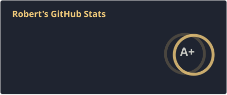
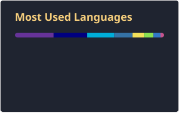

<!-- Banner -->

  
  

  

    
    
  

# 👨‍💻 Robert | Software Engineer & Consultant

Founder of <a href="https://uphillsolutions.tech">UpHill Solutions</a>, helping teams climb out of operational chaos with practical automation and maintainable software.

## 💼 About Me

- 🌍 **Location:** USA | Global Remote
- 🔭 **Currently working on:** Client projects, open-source contributions, and personal tooling
- 🧠 **Talk to Me About:** Business processes, automation, web development, backend architecture, or your current processes
- 🥾 **Fun Fact:** If I'm not online then I'm probably hiking uphill with my family (commitment to the brand)
- 📫 **Reach me:** [Schedule Free Consult](https://uphillsolutions.tech/contact/) | [Website](https://uphillsolutions.tech) | [Email](mailto:robert.hill@uphillsolutions.tech) | [LinkedIn](https://www.linkedin.com/in/robert-hill-a6a189125/)

## 🧰 Languages and Tools

<h3 align="left">Fluent in...</h3>

  

<h3 align="center">Shipping on...</h3>

  

<h3 align="right">Powered by...</h3>

  

## 📊 GitHub Stats

  

## 🧗Why UpHill Solutions?

Technology should make work easier, not tedious or repetitive with manual data entry across systems that don't connect.

We build **systems** that **simplify your processes** and **eliminate busy work** so you can focus on what really matters.

> **Our process is straightforward:**
>
> 1. Understand **who** you are, **how** you work, and **where** your friction is
> 2. Map out the climb to get you where you **want** to be
> 3. Build **what** you need, ready **when** you need it and desiged to last

We work with **nonprofits**, **startups**, and **enterprise teams** that are ready to stop doing the same work twice.

Your uphill battles are our terrain. Let’s build the path forward.

## 🤝 Get in Touch

☎️ **Let's talk:** [Schedule a call now](https://uphillsolutions.tech/contact/)

📬 **Or send an email:** <robert.hill@uphillsolutions.tech>

## 🛟 Support Open Source

If my projects save you time or make you smile, consider offering your support for maintenance and new features.

  
  

  
<em>The climb to the top continues below</em>

  <!-- Profile View Counter: Added 12/29/2025 -->
  
    <!--  -->

